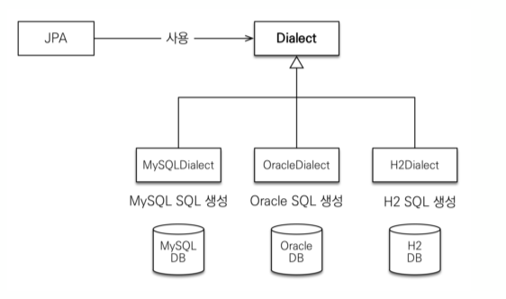

# 프로젝트 생성
>
> 작성자: @luke0408

## 목차

- [프로젝트 생성](#프로젝트-생성)
  - [목차](#목차)
  - [H2 데이터베이스](#h2-데이터베이스)
    - [H2 데이터베이스 설치](#h2-데이터베이스-설치)
    - [H2 데이터베이스 실행](#h2-데이터베이스-실행)
    - [H2의 3가지 모드1 2](#h2의-3가지-모드1-2)
  - [프로젝트 생성](#프로젝트-생성-1)
    - [메이븐 프로젝트 생성](#메이븐-프로젝트-생성)
    - [의존성 추가 - pom.xml](#의존성-추가---pomxml)
    - [JPA 설정 - persistence.xml](#jpa-설정---persistencexml)
  - [데이터베이스 방언](#데이터베이스-방언)
    - [데이터베이스 방언이란?](#데이터베이스-방언이란)
    - [Hibernate dialect 설정](#hibernate-dialect-설정)
  - [레퍼런스](#레퍼런스)

## H2 데이터베이스

**[H2 데이터 베이스 선택 이유]**
> 실습용 최고의 DB

- 인메모리 데이터베이스로 가볍고 빠름
- 웹용 쿼리툴 제공
- MySQL, Oracle 데이터베이스 시뮬레이션 가능
- 시퀀스, AUTO INCREMENT 기능 지원

### H2 데이터베이스 설치

**[다운로드 버전]**
> 기준: 강의 시점

- [H2 Download Link](http://www.h2database.com/html/main.html)
- All Downloads > Archive > Version 1.4.199 (2019-03-13)
  - Window: Windows Installer
  - Other Platforms: Platform Independent Zip

### H2 데이터베이스 실행

**[실행 방법]**

- Window: bin/h2.bat 실행
  
  ```cmd
  cd .../h2/bin
  h2.bat
  ```

- Mac/Linux/Unix: bin/h2.sh 실행
  
  ```bash
  cd .../h2/bin
  ./h2.sh
  ```

### H2의 3가지 모드<sup>[1](#footnote_1)</sup> <sup>[2](#footnote_2)</sup>
>
> H2는 Java로 작성된 오픈소스 데이터베이스로 기본적으로 JVM 위에서 구동된다.

**[In-Memory 모드]**
> H2 DB를 시스템의 메인 메모리에서 **(JVM 내부)** 실행하는 모드

<center>


</center>

- JVM 위에서 Application과 함께 실행되기 때문에 Application이 종료되면 DB도 함께 종료된다.
  - Application 종료시 DB 상의 데이터가 휘발된다. 즉, 기본적으로 영속적이지 않다.
  - 데이터에 대한 영속성을 제공하는 방법이 존제한다.
- 메인 메모리에 DB를 띄워놓고 해당 DB를 사용하는 Application의 스레드로 데이터에 바로 접근한다.
  - 데이터 읽기, 쓰기가 빠르다.
  - 데이터 캐싱 DB에 대해서도 H2를 고려할 수 있다.
- 하지만, JVM에서 데이터 연산에 사용되는 스레드를 인터럽트 하지 않을 수 있기에, I/O 수행 시에 I/O Handler가 닫힘으로써 데이터베이스에 손상을 일으킬 수 있다.

**[Embedded 모드]**
> In-Memory 모드와 동일하게 동작

- In-Memory 모드와 동일하게 동작하지만, In-Memory 모드와 달리 Application 실행시 데이터를 local에 직접 저장한다.
  - 즉, Application 종료시 DB 상의 데이터가 휘발되지 않는다.

**[Server 모드]**
> 별도의 프로세스(JVM)를 통해 DB를 동작시켜 영속성을 제공하는 모드

<center>


</center>

- local 환경에서는 localhost의 9092포트를 통해 접근할 수 있으며, 별도의 서버 위에서 동작시킬 경우에 여러 Application에서 동시적으로 접근할 수 있다.
- 서버 모드도 내부적으로는 Embedded 모드와 동일한 실행방식을 가지지만, 모든 데이터의 처리 흐름이 TCP/IP를 통해 전송되기 때문에 상대적으로 느리다.

**[Local 모드 vs Server 모드]**
> 결론: 테스트 용이라면 Local(Embedded/In-Memory) 모드를 사용하는 것이 이득

<center>

|| Local 모드 | Server 모드 |
|:---:|:---|:---|
|장점|- 메모리로 바로 접근함으로써 빠른 처리 가능<br>- Spring Boot가 지원하는 SQL 파일을 통한 쉬운 DDL, DML 적용|- 제한이 없는 Application과 DB의 커넥션<br>- PageStore 엔진의 동기화를 통해 멀티 스레딩을 지원함으로써 데이터의 정합성을 지킬 수 있음|
|단점|- JVM 시스템의 컨트롤로 인한 DB 손실<br>- Application의 스레드와 자원을 사용하기 떄문에 Application의 상태에 영향을 받음|- TCP/IP를 이용한 데이터의 흐름을 가지기 때문에 상대적으로 성능에 대한 오버헤드가 존제함<br>- 외부 서버에서 제공하고 연동 설정을 지원하지 않는 다면, 환경에 따라 해당 모드를 사용하기 위한 별도의 데이터(DDL, DML 등)이 요구됨|

</center>

## 프로젝트 생성

### 메이븐 프로젝트 생성

**[Maven 이란?]**

- Java용 프로젝트 관리 도구
- 라이브러리 자동 다운로드 및 의존성 관리
- Maven에 대한 더 자세한 설명
  - [[Maven] Maven 이란? (정의, 예제)](https://goddaehee.tistory.com/199)

**[Maven 프로젝트 생성]**

- 자바 버전: 1.8
- 메이븐 설정
  - Group Id: jpa-basic
  - Artifact Id: ex1-hello-jpa
  - Version: 1.0.0

### 의존성 추가 - pom.xml

**[pom.xml 코드]**

  ```xml
  <?xml version="1.0" encoding="UTF-8"?>
  <project xmlns="http://maven.apache.org/POM/4.0.0"
         xmlns:xsi="http://www.w3.org/2001/XMLSchema-instance"
         xsi:schemaLocation="http://maven.apache.org/POM/4.0.0 http://maven.apache.org/xsd/maven-4.0.0.xsd">
    <modelVersion>4.0.0</modelVersion>

    <groupId>jpa-basic</groupId>
    <artifactId>ex1-hello-jpa</artifactId>
    <version>1.0.0</version>

    <properties>
        <maven.compiler.source>8</maven.compiler.source>
        <maven.compiler.target>8</maven.compiler.target>
        <project.build.sourceEncoding>UTF-8</project.build.sourceEncoding>
    </properties>

    <dependencies>
        <!-- JPA 하이버네이트 -->
        <dependency>
            <groupId>org.hibernate</groupId>
            <artifactId>hibernate-entitymanager</artifactId>
            <version>5.3.10.Final</version>
        </dependency>
        <!-- H2 데이터베이스 -->
        <dependency>
            <groupId>com.h2database</groupId>
            <artifactId>h2</artifactId>
            <version>1.4.199</version>
        </dependency>
    </dependencies>

  </project>
  ```

**[의존성 설명]**
> 링크로 대체

- [JPA 하이버네이트](#hibernate-dialect-설정)
- [H2 데이터베이스](#h2-데이터베이스)

### JPA 설정 - persistence.xml
>
> JPA 설정 파일

**[세팅]**

- 위치

  ```text
  src
    └─ main
        └─ resources
            └─ META-INF
                    persistence.xml
  ```

- 코드

  ```xml
  <?xml version="1.0" encoding="UTF-8"?>
  <persistence version="2.2" xmlns="http://xmlns.jcp.org/xml/ns/persistence" xmlns:xsi="http://www.w3.org/2001/XMLSchema-instance"
             xsi:schemaLocation="http://xmlns.jcp.org/xml/ns/persistence http://xmlns.jcp.org/xml/ns/persistence/persistence_2_2.xsd">

    <persistence-unit name="hello">
        <properties>
            <!-- 필수 속성 -->
            <property name="javax.persistence.jdbc.driver" value="org.h2.Driver"/>
            <property name="javax.persistence.jdbc.user" value="sa"/>
            <property name="javax.persistence.jdbc.password" value=""/>
            <property name="javax.persistence.jdbc.url" value="jdbc:h2:tcp://localhost/~/test"/>
            <property name="hibernate.dialect" value="org.hibernate.dialect.H2Dialect"/>

            <!-- 옵션 -->
            <property name="hibernate.show_sql" value="true"/> <!-- 콘솔에 SQL을 보여줌 -->
            <property name="hibernate.format_sql" value="true"/> <!-- SQL을 보기 좋게 정렬해서 보여줌 -->
            <property name="hibernate.use_sql_comments" value="true"/> <!-- 쿼리를 사용하는 이유에 대한 주석을 보여줌 -->
            <!--<property name="hibernate.hbm2ddl.auto" value="create" />-->
        </properties>
    </persistence-unit>
  </persistence>
  ```

## 데이터베이스 방언
> JPA는 특정 데이터베이스에 종속되지 않는다. <br>
> 때문에 다양한 데이터베이스에 대응해야만 한다.

### 데이터베이스 방언이란?
<center>



</center>

- 각각의 데이터베이스가 제공하는 SQL 문법과 함수는 조금씩 다르다.
  - 가변 문자: MySQL은 VARCHAR, Oracle은 VARCHAR2
  - 문자열을 자르는 함수: SQL 표준은 SUBSTRING(), Oracle은 SUBSTR()
  - 페이징: MySQL은 LIMIT, Oracle은 ROWNUM
- 즉, 방언은 SQL 표준을 지키지 않는 특정 데이터베이스만의 고유한 기능을 말한다.

### Hibernate dialect 설정

- Hibernate는 40가지 이상의 데이터베이스 방언을 지원한다.
- Hibernate.dialect 속성
  - H2 : org.hibernate.dialect.H2Dialect
  - Oracle 10g : org.hibernate.dialect.Oracle10gDialect
  - MySQL : org.hibernate.dialect.MySQL5InnoDBDialect

## 레퍼런스

<a name="footnote_1">1</a>. [H2의 Local(In-Memory) 와 Server(TCP) 모드](https://lob-dev.tistory.com/13) <br>
<a name="footnote_2">2</a>. [H2 DB의 3가지 모드와 사용법](https://velog.io/@jinny-l/H2-DB%EC%9D%98-3%EA%B0%80%EC%A7%80-%EB%AA%A8%EB%93%9C%EC%99%80-%EC%82%AC%EC%9A%A9%EB%B2%95-Server-Mode-Embedded-Mode-In-Memory-Mode#1-buildgradle%EC%97%90-%EC%9D%98%EC%A1%B4%EC%84%B1-%EC%B6%94%EA%B0%80)
